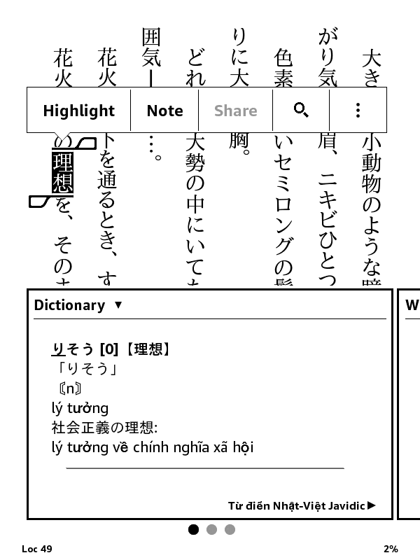
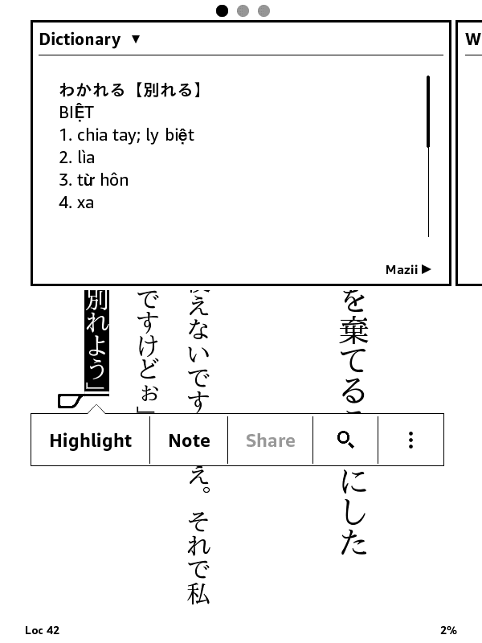

# `javidic-kindle`



|  |  |  |
| --- | --- | --- |
| | | |

## About

Dựa trên [jmdict-kindle/jmdict-kindle](https://github.com/jmdict-kindle/jmdict-kindle).

(*Từ điển Nhật - Việt cho Kindle dựa trên dữ liệu từ điển từ JaViDic*)

This is a Japanese-Vietnamese dictionary based on the Javidic database (converted from Yomichan format) for *e-Ink* Kindle devices.

> [!NOTE]  
> Phiên bản điện tử của từ điển được tạo ở đây chỉ được phép sử dụng cho mục đích giáo dục và phi lợi nhuận (For educational and non-commercial purposes only).

## Guide

- `-d` hoặc `--dict-dir`: Thư mục chứa dữ liệu Yomichan (Mặc định: `dict-data`).
- `-n` hoặc `--name`: Tên gốc của các tệp tạo ra (Mặc định: `javidic`).
- `-t` hoặc `--title`: Tiêu đề hiển thị của từ điển (Mặc định: `Từ điển Nhật-Việt Javidic`).
- `-l` hoặc `--lang`: Ngôn ngữ của nghĩa từ điển (Mặc định: `vi`).
- `-c` hoặc `--creator`: Thông tin tác giả/bản quyền (Mặc định: `Javidic (converted to Kindle)`).

```bash
python3 javidic.py -d meikyo-data -n meikyo -t "Từ điển Meikyo" -l ja -c "Meikyo Group"
```

## Build

1\. Thêm dữ liệu từ điển (Mấy tệp `.json` lấy từ một tệp từ điển Tiếng Nhật Yomitan/Yomichan bất kì) vào thư mục `dict-data/`.

2\. Run the following command in your terminal:

```bash
make javidic.mobi
```

## Tải

- [javidic.mobi](https://github.com/thu-tram/javidic-kindle/releases/download/v1.0/javidic.mobi)
- [mazii.mobi](https://github.com/thu-tram/javidic-kindle/releases/download/v1.0/mazii.mobi)

## Credits

- [Từ điển Nhật - Việt cho Yomitan](https://yomitan-vi.github.io/tu-dien-nhat-viet-yomitan/)
- [JDIC Japanese-English Dictionary for Kindle](https://github.com/jmdict-kindle/jmdict-kindle)
